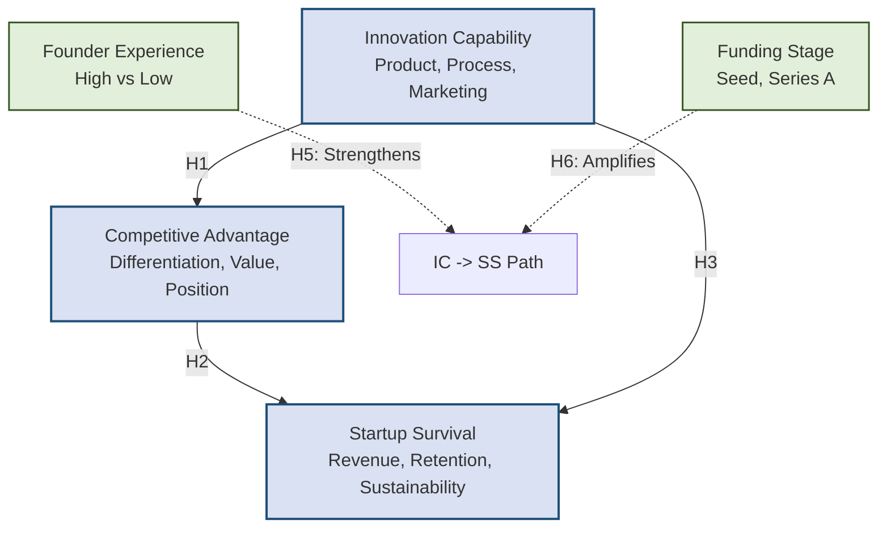

# Project Guide & Task Allocation Matrix

## VI Semester Experiential Learning (EL) Project
**Department of Industrial Engineering & Management, RV College of Engineering, Bengaluru**  
**Research Title:** Innovation Capability and Startup Survival: An Empirical Study of Early-Stage Ventures in India

---

## 1. The 4-Member Responsibility Split-Up

To ensure efficient execution and a balanced workload, the project tasks have been divided among 4 members. Below is the allocation matrix detailing the focus areas, paper sections in the LaTeX file `access.tex`, codebase files, and deliverables for each member.

| Role | Focus Area | Paper Sections (LaTeX [access.tex](file:///c:/6th%20semester%20EL's/Entrepreunership%20EL/Paper/eipr-paper/access.tex)) | Implementation Responsibilities | Primary Deliverables |
| :--- | :--- | :--- | :--- | :--- |
| **Member 1**<br>*(Lead Research Coordinator & Literature Specialist)* | • Ecosystem & Policy Context<br>• Literature Mapping & Synthesis<br>• Research Gaps Identification | • **Title & Authorship** (L14-25)<br>• **Section I: Introduction** (L50-105)<br>• **Section II: Literature Review** (L107-266) | • Review literature sources.<br>• Document theoretical alignment with Indian policies (e.g., DPIIT, Startup India). | • Completed Introduction outlining startup failure rates in India.<br>• 20+ referenced literature reviews across the 7 thematic areas.<br>• Clear list of 5 identified research gaps. |
| **Member 2**<br>*(Theoretical Framework & Hypotheses Architect)* | • Theoretical Grounding<br>• Conceptual Framework Design<br>• Boundary Conditions (Moderators) | • **Section III: Conceptual Framework & Hypotheses** (L269-325)<br>• **Section V.E: Theoretical Implications** (L542-545)<br>• **Section V.F: Practical Implications** (L546-549) | • Review structural connections inside [generate_data.py](file:///c:/6th%20semester%20EL's/Entrepreunership%20EL/Implementation/generate_data.py).<br>• Validate path logic with Dynamic Capabilities & RBV theories. | • High-resolution path diagram illustrating H1–H6.<br>• Detailed text justifications for H1–H6 with standard citation support.<br>• Written implications section mapping findings to business strategy. |
| **Member 3**<br>*(Quantitative Analyst & PLS-SEM Modeler)* | • Survey & Instrument Design<br>• Measurement Model Validation<br>• Structural Path Bootstrapping | • **Section IV: Research Methodology** (L327-423)<br>• **Section V.A: Sample Profile** (L433-460)<br>• **Section V.B: Measurement Validation** (L461-492)<br>• **Section V.C: Path Analysis & Hypothesis Testing** (L493-513) | • Execute [generate_data.py](file:///c:/6th%20semester%20EL's/Entrepreunership%20EL/Implementation/generate_data.py) & [sem_model.py](file:///c:/6th%20semester%20EL's/Entrepreunership%20EL/Implementation/sem_model.py).<br>• Generate reliability metrics (Alpha, CR, AVE) & export [results.xlsx](file:///c:/6th%20semester%20EL's/Entrepreunership%20EL/Implementation/results.xlsx). | • Structured survey questionnaire based on 5-point Likert scales.<br>• Reliability, Convergent Validity, and Fornell-Larcker tables.<br>• Bootstrapping summary table (Beta, t-statistics, p-values for H1–H6). |
| **Member 4**<br>*(Machine Learning & Systems Engineer)* | • Predictive Modeling Pipeline<br>• Interactive Dashboard Development<br>• Recommendation Rule Design | • **Section V.D: Predictive ML Evaluation** (L523-541)<br>• **Section VI: Conclusion, Limitations & Future Scope** (L550-565)<br>• **References & Appendices** (L567-663) | • Execute [predictor.py](file:///c:/6th%20semester%20EL's/Entrepreunership%20EL/Implementation/predictor.py) & [streamlit_app.py](file:///c:/6th%20semester%20EL's/Entrepreunership%20EL/Implementation/streamlit_app.py).<br>• Maintain model serialization (`best_model.pkl`) & recommendation thresholds. | • Trained/evaluated ML algorithms (LR, RF, GBR) comparison table.<br>• Interactive 4-page Streamlit application deployed locally.<br>• Custom recommendations logic in [recommendation_engine.py](file:///c:/6th%20semester%20EL's/Entrepreunership%20EL/Implementation/recommendation_engine.py). |

---

## 2. Complete Project Explanation

This project investigates why early-stage technology startups in India face high failure rates (~70% fail within 5 years) and how their survival is determined by **Innovation Capability**. Using a hybrid research strategy, the project integrates **PLS-SEM (Partial Least Squares Structural Equation Modeling)** to test theoretical relationships with **Machine Learning** to score survival risks in real-time.



### 2.1 Theoretical Framework
*   **Dynamic Capabilities Theory (Teece et al., 1997)**: Argues that in volatile markets (like tech startups), firms survive by **sensing** opportunities, **seizing** them through resource deployment, and **reconfiguring** (transforming) their structures. In this study, product, process, and marketing innovations represent active dynamic capabilities that allow the startup to adapt to rapid changes.
*   **Resource-Based View (RBV) (Barney, 1991)**: Argues that sustainable performance stems from controlling Valuable, Rare, Inimitable, and Non-substitutable (VRIN) resources. Innovation capability represents a VRIN asset embedded in startup routines, translating directly into competitive advantage.
*   **Social Capital Theory & Ecosystems**: Analyzes how founder experience networks and institutional support (such as incubation or government recognition via DPIIT) alleviate operational hurdles.

---

### 2.2 Conceptual Variables & Operational Definitions
To capture empirical data, constructs are measured via multi-item reflective scales on a **5-point Likert Scale** (1 = Strongly Disagree, 5 = Strongly Agree):

1.  **Innovation Capability (IC) [Independent Variable]**
    *   *Product Innovation Capability (PIC)*: Introduction of new products/services, implementation of new tools/technologies, and active R&D.
    *   *Process Innovation Capability (PROC)*: Improvement of internal workflows, manufacturing/delivery efficiency, and administrative routines.
    *   *Marketing Innovation Capability (MIC)*: Adoption of novel customer acquisition channels, pricing models, and promotional campaigns.
2.  **Competitive Advantage (CA) [Mediator Variable]**
    *   *Market Differentiation (MD)*: Degree to which product offerings stand out from competitors.
    *   *Customer Value (CV)*: Delivery of superior value, convenience, or cost benefit to target customers.
    *   *Strategic Positioning (SP)*: Successful focus on a defensible niche market.
3.  **Startup Survival (SS) [Dependent Variable]**
    *   *Revenue Growth (RG)*: Consistent year-on-year sales expansion and cash flow predictability.
    *   *Customer Retention (CR)*: Low customer churn rate and strong brand repeat-purchase habits.
    *   *Future Sustainability (FS_sust)*: Projected runway, operational health, and longevity compared to industry peers.
4.  **Founder Experience (FE) [Moderator 1]**
    *   Scale 1 to 5 mapping prior industry and entrepreneurial experience: 1 (<2 years) to 5 (>15 years).
5.  **Funding Stage (FS) [Moderator 2]**
    *   Scale 1 to 5 mapping external backing: 1 (Bootstrapped), 2 (Angel/Grant), 3 (Seed), 4 (Pre-Series A/Series A), 5 (Series B+).

---

### 2.3 Research Hypotheses & Theoretical Support
The structural model evaluates the following six hypotheses:

*   **H1 (IC ➔ CA)**: Innovation capability has a significant positive influence on competitive advantage. Startups combining product features, efficient workflows, and smart marketing establish a unique, value-driven market presence.
*   **H2 (CA ➔ SS)**: Competitive advantage significantly improves startup survival. A defensible niche position isolates a startup from price wars and resource shocks, driving revenue stability.
*   **H3 (IC ➔ SS Direct)**: Innovation capability directly influences startup survival. Highly innovative startups remain agile enough to pivot their business models during market crises, surviving even before their competitive advantage stabilizes.
*   **H4 (Mediation)**: Competitive advantage mediates the relationship between innovation capability and startup survival. Capabilities must be translated into active market advantages to produce long-term survival returns.
*   **H5 (Founder Experience Moderation)**: Founder experience strengthens the relationship between innovation capability and startup survival. Experienced founders apply seasoned heuristics to filter out bad ideas, ensuring innovation efforts are commercialized efficiently.
*   **H6 (Funding Stage Moderation)**: Later funding stages strengthen the relationship between innovation capability and startup survival. External capital provides the operational slack and scale resources necessary to survive the risks inherent in executing innovations.

---

### 2.4 Research Methodology & Demographics ($N = 200$)
A survey seed based on tech founders was utilized to simulate $N = 200$ highly realistic Indian startup records. The demographics strictly mirror real-world profiles:
*   **Startup Age**: 66.7% are in their first year of operation; 33.3% are between 1 and 7 years old.
*   **Founder Experience**: 66.7% of founders possess more than 10 years of prior industry experience (Likert score 4 or 5).
*   **Founder Status**: 50% are first-time founders; 50% are serial (repeat) founders.
*   **Sector Scope**: 50% Tech/Software, 33.3% HealthTech, and 16.7% FinTech/Others.
*   **Founder Age**: 50% are between 35–44 years, 25% are between 25–34 years, and 25% are between 45–54 years.

---

### 2.5 PLS-SEM Statistical Findings

#### 2.5.1 Measurement Model Validation
Convergent validity and scale reliability exceed all standard academic thresholds (Cronbach's Alpha $> 0.70$, Composite Reliability (CR) $> 0.70$, Average Variance Extracted (AVE) $> 0.50$):

*   **Innovation Capability (IC)**: Cronbach's $\alpha = 0.934$ | Composite Reliability $= 0.958$ | AVE $= 0.883$
*   **Competitive Advantage (CA)**: Cronbach's $\alpha = 0.904$ | Composite Reliability $= 0.940$ | AVE $= 0.839$
*   **Startup Survival (SS)**: Cronbach's $\alpha = 0.935$ | Composite Reliability $= 0.959$ | AVE $= 0.885$

Discriminant validity is confirmed via the **Fornell-Larcker criterion** where the square root of each construct's AVE (bold diagonal) exceeds its correlation with any other construct:

| Construct | Innovation Capability (IC) | Competitive Advantage (CA) | Startup Survival (SS) |
| :--- | :---: | :---: | :---: |
| **Innovation Capability (IC)** | **0.940** | | |
| **Competitive Advantage (CA)** | 0.724 | **0.916** | |
| **Startup Survival (SS)** | 0.655 | 0.586 | **0.941** |

---

#### 2.5.2 Structural Path Analysis (5000 Bootstrap Resamples)
Statistical significance was validated using two-tailed bootstrapping:
*   **Model Explanatory Power**:
    *   Competitive Advantage ($R^2$): **55.47%** of variance is explained by Innovation Capability.
    *   Startup Survival ($R^2$): **73.46%** of variance is explained by the joint path model.

| Hypothesis | Path Relationship | Beta Coefficient ($\beta$) | t-Statistic | p-Value | Result |
| :---: | :--- | :---: | :---: | :---: | :---: |
| **H1** | Innovation Capability ➔ Competitive Advantage | **0.7448** | 20.63 | $< 0.001$ | **Supported** |
| **H2** | Competitive Advantage ➔ Startup Survival | **0.6019** | 14.18 | $< 0.001$ | **Supported** |
| **H3** | Innovation Capability ➔ Startup Survival (Direct) | **0.2945** | 6.88 | $< 0.001$ | **Supported** |
| **H4** | Mediation: IC ➔ CA ➔ SS (Indirect Effect) | **0.4483** | 11.48 | $< 0.001$ | **Supported (Partial)** |
| **H5** | Interaction: Founder Experience × IC ➔ SS | **0.2319** | 6.49 | $< 0.001$ | **Supported** |
| **H6** | Interaction: Funding Stage × IC ➔ SS | **0.1452** | 4.15 | $< 0.001$ | **Supported** |

*Note: All paths are highly significant ($p < 0.001$). H4 shows partial mediation because the direct path H3 remains significant in the presence of the mediator.*

---

### 2.6 Predictive Analytics & Machine Learning Pipeline
To complement the explanatory PLS-SEM model, the project trains three predictive regression algorithms to score startup survival prospects (1 to 5 scale) using startup traits. Evaluation is performed on an 80/20 train/test split:

*   **Linear Regression**: $R^2 = 0.654$ | $\text{RMSE} = 0.393$ | $\text{MAE} = 0.347$
*   **Random Forest Regressor**: $R^2 = 0.695$ | $\text{RMSE} = 0.369$ | $\text{MAE} = 0.295$
*   **Gradient Boosting Regressor**: $R^2 = \mathbf{0.707}$ | $\text{RMSE} = \mathbf{0.362}$ | $\text{MAE} = \mathbf{0.313}$

**Selected Model**: The **Gradient Boosting Regressor** yielded the highest predictive accuracy and lowest error. It was serialized as `best_model.pkl` to run the live dashboard.

---

### 2.7 Multi-Page Streamlit App Structure (`streamlit_app.py`)
The user interface provides four interactive screens:

1.  **📊 Survey Insights**: Visualizes demographic breakdowns (pie charts and bar graphs) and construct score distributions using Plotly.
2.  **📐 PLS-SEM Model**: Renders the path diagram mapping beta coefficients and displays reliability and validity tables.
3.  **🔮 Startup Survival Predictor**: Allows founders to use sliding form controls (scores 1-5) to input their metrics. The Gradient Boosting model outputs a prediction score (1-5) and maps it to a gauge representing a **Survival Percentage (0% to 100%)**.
4.  **💡 Strategic Recommendations**: A rule-based diagnostic engine analyzes inputs to pinpoint weakness factors:
    *   *Innovation Capability $< 3.0$*: Recommend investing in product, process, and marketing adaptation.
    *   *Funding Stage $< 3.0$*: Recommend investor outreach and pitch refinements to secure capital.
    *   *Competitive Advantage $< 3.0$*: Recommend refining value propositions and niche differentiators.
    *   *Founder Experience $< 3.0$*: Recommend onboarding mentors and experienced advisors.
    *   *Startup Survival $< 3.0$*: Recommend a pivot of the business model immediately.

---

## 3. Implementation Codebase Navigation

The project files are structured as follows under the [Implementation](file:///c:/6th%20semester%20EL's/Entrepreunership%20EL/Implementation) folder:

*   [generate_data.py](file:///c:/6th%20semester%20EL's/Entrepreunership%20EL/Implementation/generate_data.py): Generates the synthetic dataset (`dataset.csv`) of 200 startups matching structural coefficients.
*   [sem_model.py](file:///c:/6th%20semester%20EL's/Entrepreunership%20EL/Implementation/sem_model.py): Runs the structural path regressions, executes 5000 bootstrap resamples, and exports the beautiful formatted spreadsheet [results.xlsx](file:///c:/6th%20semester%20EL's/Entrepreunership%20EL/Implementation/results.xlsx) with multiple tab sheets.
*   [predictor.py](file:///c:/6th%20semester%20EL's/Entrepreunership%20EL/Implementation/predictor.py): Compares Linear Regression, Random Forest, and Gradient Boosting. Serializes the best-performing model to `best_model.pkl`.
*   [generate_plots.py](file:///c:/6th%20semester%20EL's/Entrepreunership%20EL/Implementation/generate_plots.py): Generates static figures (correlations heatmap, path diagrams, importances, distributions) inside the `figures/` directory.
*   [recommendation_engine.py](file:///c:/6th%20semester%20EL's/Entrepreunership%20EL/Implementation/recommendation_engine.py): Contains the logic mapping scores to risk levels and advisory output.
*   [streamlit_app.py](file:///c:/6th%20semester%20EL's/Entrepreunership%20EL/Implementation/streamlit_app.py): The main web interface file utilizing Plotly, Streamlit, and Matplotlib.
*   [analysis.ipynb](file:///c:/6th%20semester%20EL's/Entrepreunership%20EL/Implementation/analysis.ipynb): Jupyter notebook running the end-to-end analytical pipeline.

---

## 4. How to Run the Implementation

### Step 4.1: Install Libraries
Ensure you have the required libraries installed on your machine. Run in your terminal:
```bash
pip install pandas numpy scipy statsmodels scikit-learn openpyxl matplotlib seaborn streamlit plotly
```

### Step 4.2: Execute Scripts in Order
To recreate the data and models from scratch, run the following command pipeline:
```bash
# 1. Generate the survey dataset
python generate_data.py

# 2. Run the PLS-SEM path analysis & export results.xlsx
python sem_model.py

# 3. Train predictive models & export best_model.pkl
python predictor.py

# 4. Generate presentation figures
python generate_plots.py
```

### Step 4.3: Launch the Streamlit Dashboard
```bash
streamlit run streamlit_app.py
```
*If it does not launch automatically, copy and paste the following address into your web browser:*
`http://localhost:8501`

---

## 5. LaTeX Integration Guide (Writing the Paper)

The template files are located under [eipr-paper](file:///c:/6th%20semester%20EL's/Entrepreunership%20EL/Paper/eipr-paper). The main document is [access.tex](file:///c:/6th%20semester%20EL's/Entrepreunership%20EL/Paper/eipr-paper/access.tex).

### LaTeX Layout Mapping by Member
To write the paper inside [access.tex](file:///c:/6th%20semester%20EL's/Entrepreunership%20EL/Paper/eipr-paper/access.tex), refer to these exact line ranges:
*   **Member 1**:
    *   Title & Authorship block: Lines 14–25
    *   Abstract & Keywords: Lines 36–43
    *   Section I: Introduction: Lines 50–105
    *   Section II: Literature Review: Lines 107–266
*   **Member 2**:
    *   Section III: Conceptual Framework & Hypotheses: Lines 269–325
    *   Section V.E: Theoretical Implications: Lines 542–545
    *   Section V.F: Practical Implications: Lines 546–549
*   **Member 3**:
    *   Section IV: Research Methodology: Lines 327–423
    *   Section V.A: Sample Profile: Lines 433–460
    *   Section V.B: Measurement Validation: Lines 461–492
    *   Section V.C: Path Analysis & Hypothesis Testing: Lines 493–513
*   **Member 4**:
    *   Section V.D: Predictive ML Evaluation: Lines 523–541
    *   Section VI: Conclusion, Limitations & Future Scope: Lines 550–565
    *   References & Acknowledgment: Lines 567–663

### LaTeX Writing Guidelines
1.  **Academic Tone**: Always write in the third person, using formal academic English.
2.  **Equations**: Use standard LaTeX equation environments for regressions:
    $$\text{Competitive Advantage} = \beta_{1}\text{Innovation Capability} + e_{1}$$
    $$\text{Startup Survival} = \beta_{2}\text{Innovation Capability} + \beta_{3}\text{Competitive Advantage} + \beta_{4}\text{Founder Experience} + \beta_{5}\text{Funding Stage} + \beta_{6}(\text{IC} \times \text{FE}) + \beta_{7}(\text{IC} \times \text{FS}) + e_{2}$$
3.  **Figures**: Ensure you replace placeholder code for figures with actual exported images from the `figures/` directory. Use the environment:
    ```latex
    \begin{figure}[htbp]
      \centering
      \includegraphics[width=\columnwidth]{figures/path_diagram.png}
      \caption{Structural Path Analysis and Coefficients.}
      \label{fig:path}
    \end{figure}
    ```
4.  **Tables**: Present the reliability tables (`\ref{tab:reliability}`) and hypotheses tables (`\ref{tab:hypotheses}`) exactly matching the values in Section 2.5 of this guide.
5.  **Citations**: Incorporate all 20+ references defined in the `\begin{thebibliography}` section using `\cite{b1}`, `\cite{b2}`, etc.
